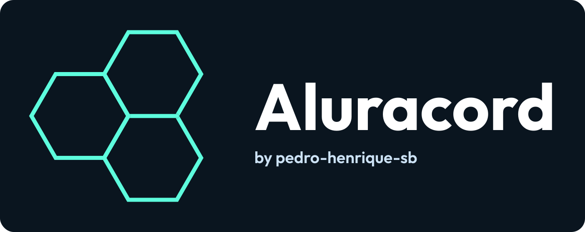
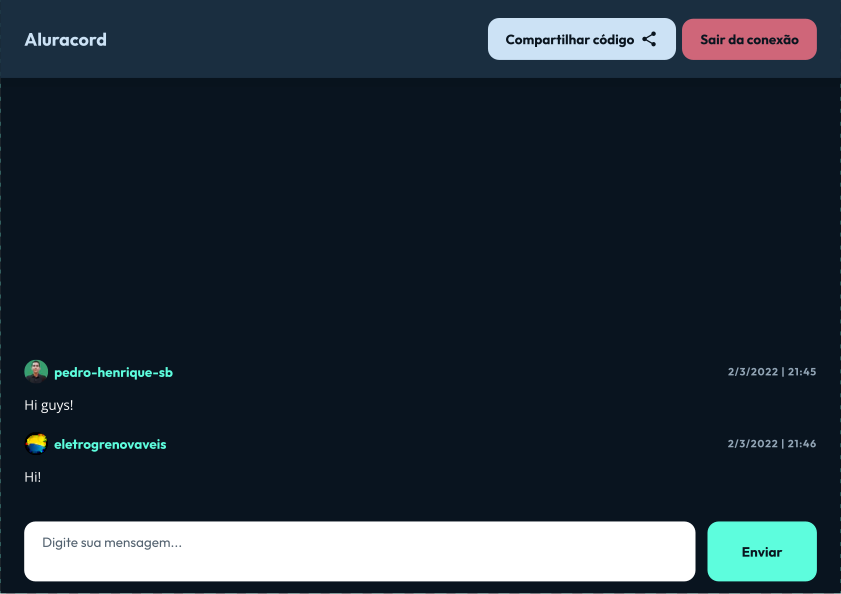

<h1 align="center"></h1>

  
  

## 📑 Description

A chat app created during the fourth edition of Alura's React Immersion.

## 🧰 Technologies

This project was developed with the following technologies:

- [React](https://reactjs.org/)
- [TypeScript](https://www.typescriptlang.org/)
- [Supabase](https://supabase.com/)
- [Nookies](https://github.com/maticzav/nookies)
- [Styled-components](https://styled-components.com/)

## 🧪 How to experiment

Access the version currently on air on [https://aluracord-eosin-nine.vercel.app/](https://aluracord-eosin-nine.vercel.app/).

## 📃 Terms of use

These terms apply to those who use or will use the version of the application that is currently live.

This is an application created for learning purposes. Therefore, any risk or damage that the user runs or will suffer is his responsibility. It is not guaranteed that the application will be completely free of threats. The application is delivered "as is".

Estes termos se aplicam aos que utilizam ou utilizarão a versão da aplicação que está no ar.

Esta é uma aplicação criada para fins de aprendizado. Sendo assim, qualquer risco ou dano que o usuário corra ou venha a sofrer são de sua responsabilidade. Não é garantido que a aplicação estará totalmente livre de ameaças. A aplicação é entregue "tal como está".

---

Criado com orgulho durante a 4ª edição da Imersão Alura. 🤿
